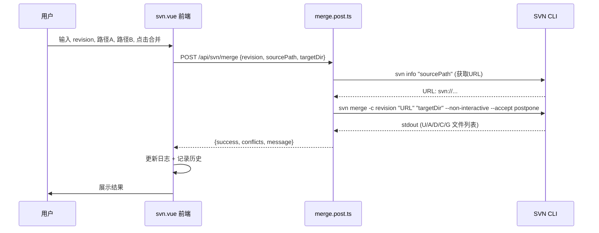

## 用户需求

在现有 SVN Patch 工具的基础上，**新增一个独立的 SVN Merge 工具**，不修改现有 svn patch 功能。

## 产品概述

新增 SVN Merge 功能，基于 `svn merge -c <revision>` 命令，将指定提交合并到目标工作副本。与现有 svn patch 相比，svn merge 使用 SVN 版本历史进行三路合并，冲突直接以 `<<<<<<<`/`=======`/`>>>>>>>` 标记写入文件中，无需处理 `.rej` 文件。

## 核心功能

- 输入 revision、路径 A（源）、路径 B（目标），一键执行 `svn merge -c <revision>`
- 后端自动将本地路径 A 通过 `svn info` 转换为 SVN URL
- 合并结果在日志区域实时展示，包含成功/冲突/跳过的文件列表
- 冲突文件直接在文件内标记，提示用户搜索 `<<<<<<<` 解决
- 合并结果记录到已有的合并历史中，方便回查
- 在右栏新增 SVN Merge 操作区域，独立于现有 Patch 操作，包含确认对话框

## 技术栈

- 前端：Nuxt 4 (Vue 3) + 全局 Fluent Design 暗色主题 CSS
- 后端：Nitro Server (H3)，`child_process.exec` 执行 SVN 命令
- 复用现有 `$fetch` 请求模式、`localStorage` 持久化、Toast/Modal 组件

## 实现方案

### 整体策略

新增一个独立的后端 API `merge.post.ts`，负责执行 `svn merge -c <revision>`。前端在右栏现有 Patch 操作区域下方增加 SVN Merge 操作区块，复用路径 A/B 和 Revision 输入，以及日志输出和合并历史功能。

### 关键技术决策

**1. 自动获取 SVN URL**
`svn merge` 的源参数必须是 SVN URL，不能是本地路径。后端通过 `svn info "<本地路径>"` 提取 `URL:` 行，自动将用户输入的本地路径转换为 SVN URL。如果用户输入的已经是 `svn://` 或 `http(s)://` 开头则直接使用。

**2. 输出解析逻辑**
`svn merge` 的输出格式与 `svn patch` 类似但不完全相同：

- `U    path` — 文件更新成功
- `A    path` — 新文件添加
- `D    path` — 文件删除
- `C    path` — 文件冲突（冲突标记写入文件）
- `G    path` — 文件合并（有非冲突改动）
-  `U   path` — 属性更新
复用 apply.post.ts 中类似的正则解析模式，适配 merge 输出。

**3. 错误处理**
`svn merge` 在有冲突时 exit code 可能为 0（因为冲突已写入文件），也可能在其他错误时 exit code 非 0。需要同时捕获 stdout 和 stderr，综合判断。使用 `--non-interactive --accept postpone` 参数确保命令不卡在交互提示上，冲突自动 postpone。

**4. 前端 UI 布局**
在右栏 card-body 中新增一个分隔的 Merge 操作区块，包含一个大按钮"SVN Merge 到路径 B"。不依赖 patchContent（不需要先生成 diff），只需 revision + pathA + pathB 即可执行。使用独立的 `isMerging` 状态与 `showMergeConfirm` 弹窗，避免与 patch 操作互相干扰。

## 实现注意事项

- **maxBuffer**：`svn merge` 在大量文件时输出可能很长，保持 `10 * 1024 * 1024` 的 buffer 限制。
- **编码问题**：Windows 下 SVN 输出可能包含中文路径，`exec` 使用 `encoding: 'utf-8'` 且 SVN 命令通常输出 UTF-8。
- **不修改现有代码**：现有 `apply.post.ts` 和前端的 patch 逻辑完全不动，只做增量新增。
- **共用 isWorking**：新增的 `isMerging` 纳入 `isWorking` computed 属性，确保 merge 进行中时其他操作按钮禁用。

## 架构设计

### 数据流



## 目录结构

```
web-ui/
├── server/api/svn/
│   ├── apply.post.ts          # [不修改] 现有 svn patch 应用逻辑
│   ├── diff.post.ts           # [不修改] 现有 svn diff 生成逻辑
│   ├── log.post.ts            # [不修改] 现有 svn log 查看逻辑
│   └── merge.post.ts          # [新增] SVN Merge API。接收 {revision, sourcePath, targetDir}，自动通过 svn info 获取 SVN URL，执行 svn merge -c <rev> 并解析输出，返回成功/冲突/失败结果。
└── app/pages/
    └── svn.vue                # [修改] 在右栏新增 SVN Merge 操作区块：新增大按钮、确认弹窗、isMerging 状态、doMerge 函数。复用已有日志输出和合并历史。共用 isWorking 状态互斥。
```

## 关键代码结构

```typescript
// merge.post.ts 核心接口
interface MergeResult {
    updated: string[]    // U/G/A/D 成功的文件
    conflicts: string[]  // C 冲突的文件
    skipped: string[]    // Skipped 跳过的文件
}

// POST body
interface MergeRequest {
    revision: string     // 提交号，如 "12345"
    sourcePath: string   // 路径A（本地路径或SVN URL）
    targetDir: string    // 路径B（目标本地工作副本）
}
```